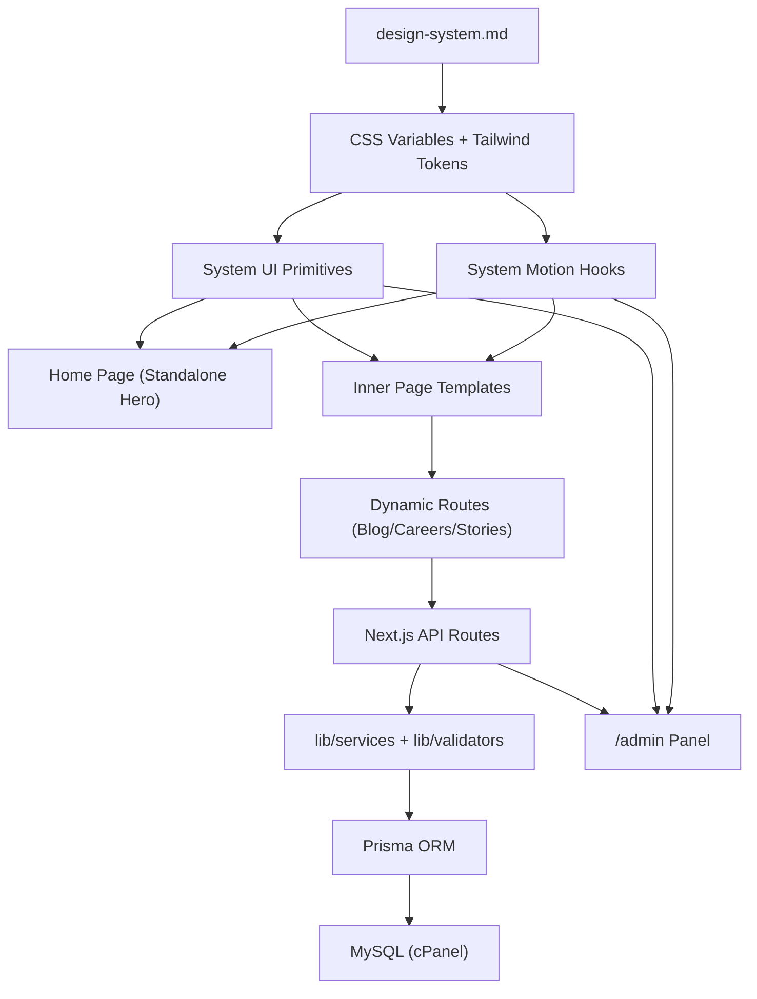

# Full Development Foundation Plan

## Scope and Non-Negotiables
- Stack: Next.js App Router full-stack, Next.js API routes, Prisma ORM, MySQL on cPanel, PM2 deployment, local/cPanel image storage only.
- Visual system: strict black/white/orange family, no off-brand accent colors.
- Motion system: GSAP + ScrollTrigger only, reusable patterns only, no random per-section experiments.
- Homepage hero remains standalone; all other pages use a consistent inner-page hero framework.
- Dynamic modules required: blog, careers, success stories + admin management.

## Step 1: Global Design System
- Create canonical spec doc at [d:/bheard/docs/design-system.md](d:/bheard/docs/design-system.md).
- Define:
  - Color tokens: brand orange shades + neutral surfaces/text/borders.
  - Typography scale: display/headline/title/body/label.
  - Spacing and layout rhythm: 4/8 base, section paddings, content width rules.
  - Border/radius/shadow constraints for premium but minimal visuals.
  - Component anatomy rules (hero, cards, media blocks, section headers, forms, tables).
  - Page composition rules (home vs inner pages).

## Step 2: Tailwind + CSS Variable Contract
- Add semantic CSS variables in [d:/bheard/app/globals.css](d:/bheard/app/globals.css).
- Refactor theme keys in [d:/bheard/tailwind.config.ts](d:/bheard/tailwind.config.ts):
  - Keep existing utility compatibility.
  - Add semantic aliases (`brand`, `surface`, `text`, `border`, `motion` tokens).
- Add docs table in [d:/bheard/docs/design-system.md](d:/bheard/docs/design-system.md) mapping token names to Tailwind classes.

## Step 3: Central Motion System
- Create folder: [d:/bheard/components/system/motion](d:/bheard/components/system/motion).
- Implement reusable hooks/utilities:
  - `useFadeUpScrub()`
  - `useStaggerReveal()`
  - `useParallaxScroll()`
  - `useTextSplitReveal()`
  - `useMaskReveal()`
  - `useLineDraw()`
  - `useHoverParallax()`
  - `useHoverLift()`
- Add global motion rules:
  - Scroll-driven first (`scrub`) where appropriate.
  - Reversible timelines.
  - Shared timing/easing presets.
  - Reduced motion fallback path.
- Replace ad-hoc animation selectors with explicit motion wrappers/attributes.

## Step 4: Reusable UI System
- Create shared UI primitives in [d:/bheard/components/system](d:/bheard/components/system):
  - `SectionShell`
  - `SectionHeading`
  - `ContentCard`
  - `InnerPageHero`
  - `MotionWrapper`
- Ensure primitives are motion-aware by default (optional flags, no mandatory heavy effects).

## Step 5: Consistent Page Structures
- Keep [d:/bheard/app/page.tsx](d:/bheard/app/page.tsx) unique as flagship homepage.
- Create route-group driven inner layout scaffold:
  - [d:/bheard/app/(site)/layout.tsx](d:/bheard/app/(site)/layout.tsx)
- Build template-driven pages (shared structure, content variance only):
  - Brand solutions, tech solutions.
  - Success stories listing + `[slug]` detail.
  - Blog listing + `[slug]` detail.
  - Careers listing + `[slug]` detail.
  - About, Contact, Privacy.

## Step 6: Backend Architecture (Next.js API + Prisma + MySQL)
- Data layer structure:
  - [d:/bheard/lib/db](d:/bheard/lib/db)
  - [d:/bheard/lib/services](d:/bheard/lib/services)
  - [d:/bheard/lib/validators](d:/bheard/lib/validators)
- Prisma models (initial):
  - `BlogPost`
  - `Career`
  - `SuccessStory`
  - `MediaAsset`
  - `SEO`
- API route groups:
  - `app/api/blog/*`
  - `app/api/careers/*`
  - `app/api/success-stories/*`
  - `app/api/media/*`
- Add image/media strategy for cPanel storage under `/public/uploads` and DB references.

## Step 7: Admin Panel Foundation
- Create branded admin at [d:/bheard/app/admin](d:/bheard/app/admin).
- Modules:
  - Dashboard
  - Blog CRUD
  - Careers CRUD
  - Success stories CRUD
  - Media upload/selection
- Reuse same tokenized UI primitives and motion system (minimal in admin).
- Add content workflow baseline (draft/publish) and simple role-ready structure.

## Step 8: Page Transition and Motion Governance
- Add route transition orchestrator in shared layout.
- Provide fixed transition presets (choose one default):
  - Soft crossfade + slight translate
  - Mask wipe
  - Fade-slide
- Enforce max 4–5 animation patterns site-wide; no section-level style drift.

## Step 9: Performance and Deployment Foundation
- Performance constraints:
  - Lazy-load heavy sections/media.
  - Keep animations transform/opacity-centric.
  - Avoid scroll pin overuse and animation overlap.
- Deployment:
  - cPanel Node app + PM2 process strategy.
  - Environment management for MySQL credentials.
  - Build/start scripts and production checks.

## Step 10: Implementation Order
1. Design-system doc and token contract.
2. Tailwind/CSS variable mapping.
3. Motion system package.
4. Reusable UI primitives.
5. Page templates and routing skeleton.
6. Prisma schema + API/services/validators.
7. Admin panel CRUD flows.
8. Route transitions + final motion consistency pass.
9. QA: visual consistency, animation coherence, performance, accessibility.

## Architecture Diagram

## Deliverables for Phase Approval
- Design system specification file ready for team usage.
- Motion pattern catalog with reusable hooks and usage examples.
- Shared section and hero primitives for all upcoming pages.
- Backend schema and API architecture blueprint.
- Admin information architecture and CRUD module plan.