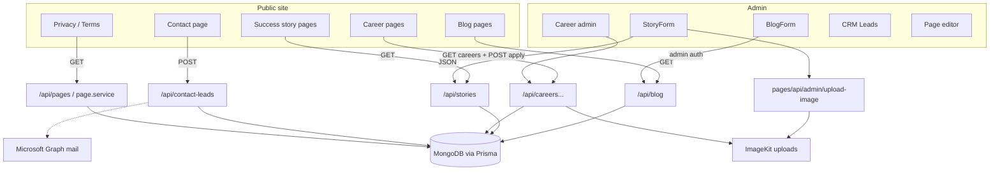

# BHEARD website — structure, design system, motion, admin, and data flow

This document describes the **BHEARD** (readability: B-H-E-A-R-D) marketing site and admin panel as implemented in this repository. Use it as a reference for UX, animation, CMS, and architecture discussions.

---

## Branding note

Public-facing copy and metadata use **“BHEARD”** (all caps). The product name aligns with pronunciation “Bee-heard” / spelled-out B-E-A-R-D framing for clarity.

---

## 1. Visual design system

### 1.1 Core aesthetic

- **Positioning:** Kinetic, editorial agency feel — large display typography, kinetic hero, scroll-driven storytelling, dark hero moments vs light content bands.
- **Storytelling bias:** Long-form sections, strong section labels (“eyebrows”), character-level or scrubbed reveals, and pinned or parallax moments to guide scrolling.

### 1.2 Color system

**Marketing / site (`tailwind.config.ts` extended tokens)**

| Role              | Typical token / hex                                      | Use                          |
|-------------------|----------------------------------------------------------|-------------------------------|
| Background / paper| `surface` `#f7f7f5`, `background` (CSS var)             | Page base                     |
| Primary orange    | `primary` `#ff923e`, `primary-fixed` `#ff8928`          | CTAs, accents, highlights     |
| Dark / inverse    | `inverse-surface` `#111827`, `surface-dim` `#0e0e0e`     | Dark bands, hero contrast     |
| Text              | `on-background` / `on-surface` `#111827`, `on-surface-variant` `#4b5563` | Hierarchy        |
| Containers        | `surface-container*`, `surface-bright`                   | Cards, panels                 |

**ShadCN / admin (`app/globals.css`)**

- Light and `.dark` themes define `--background`, `--foreground`, `--primary`, `--muted`, `--destructive`, `--card`, `--border`, etc.
- Admin shell uses these for sidebar, header, popovers, and forms.

### 1.3 Typography

From `app/layout.tsx` + `tailwind.config.ts`:

- **Headlines:** `Space Grotesk` → `font-headline` → `--font-space-grotesk`
- **Body & labels:** `Manrope` → `font-body`, `font-label` → `--font-manrope`
- **Scale utilities:** `display-xl`, `display-lg`, `headline`, `title`, `body-lg`, `label-sm` (some use `clamp()` for responsive display type)

**Prose / blog:** `@tailwindcss/typography`; `globals.css` maps prose headings to Space Grotesk and body to Manrope.

### 1.4 Textures & surface treatments

From `globals.css` and components:

- **`bg-grain`** — subtle dot grain overlay (`::after`), low opacity.
- **`glass-panel`** — translucent white + backdrop blur.
- **`kinetic-text`** — tight line-height / tracking for display blocks.
- **`img-editorial`** — grayscale + contrast for editorial photography where used.
- **Gradients / blurs** — heroes and listing banners (dark gradients, orange glows).
- **Borders** — `border-outline-variant`, `border-inverse-surface/…`.

### 1.5 Layout rhythm

`components/system/sectionTheme.ts`:

- Horizontal: **`sectionPageX`** → `px-8`
- Vertical bands: `sectionBandY`, `sectionBandYCompact`, `sectionStackBottom` / `sectionStackTop` to avoid double-padding between same-background sections.

### 1.6 Motion defaults

`lib/motion/config.ts`:

- **ScrollTrigger** registered on the client; default start/end.
- Easings: `power2.out`, `power3.out`, `expo.out` (hero), scrub uses `none`.
- **`prefers-reduced-motion`:** many components skip or finalize animations.

---

## 2. Front-end architecture (App Router)

### 2.1 Root layout

- `app/layout.tsx`: fonts, `MotionRoot` (GSAP/ScrollTrigger defaults), `globals.css`.

### 2.2 Marketing layout (`app/(site)/layout.tsx`)

- **`Navbar`**, **`main`** (top padding for fixed nav), **`SitePageTransition`**, **`Footer`**.

**Note:** **`app/page.tsx` (home)** is **outside** `(site)` — it renders its own `Navbar` / `Footer` and **does not** use `SitePageTransition`.

### 2.3 Page transitions

`components/site/SitePageTransition.tsx`:

- On route change: **clip-path wipe** upward (~0.72s).
- **Disabled** for `/careers` and `/careers/*`.
- **`prefers-reduced-motion`:** no clip animation.
- This is navigation **one-shot**, not scroll-scrub; scrolling back **does not** reverse the clip.

---

## 3. GSAP & scroll reversal

### Scrub-linked (reverses when scrolling up)

Tweens with `scrollTrigger: { scrub }` tie progress to scroll — ** scrolling up rewinds**.

Examples:

- **`initHeadingLetterScrub`** (`lib/motion/animations.ts`) — per-character spans, scrubbed opacity/y.
- **`SectionCharReveal`** (`components/motion/SectionCharReveal.tsx`) — timeline + scrub; `viewportPin` pins while scrub runs.
- **`scrollScrub`** helper — generic reversible reveals.

### One-shot (not reversed by scroll)

- **`fadeUpScrollOnce`** — typically fires once entering viewport.
- Home **hero timeline** (`HeroSection.tsx`) — load choreography.
- **Site clip-path transition** — forward then cleared.

### Global home enhancer

`components/ScrollRevealEffects.tsx`:

- In `main`, targets `h2[data-g-step], h3[data-g-step]` → `initHeadingLetterScrub` (skips `[data-motion-pinned]`, `[data-motion-exclude]`).
- Targets `[data-g-step="true"]` → `fadeUpScrollOnce` with same exclusions.

---

## 4. Public pages (summary)

### `/` Home

Sections: Navbar → HeroSection → OurBeliefSection (`SectionCharReveal` pin) → ServicesSection → ClientLogos → ServicesVariantOne → WorkSection → AboutSection → CTASection → ScrollRevealEffects → Footer.

### Under `(SitePageTransition)`

- **`/about`** — `AboutPageView`, GSAP sections.
- **`/brand-solutions`**, **`/tech-solutions`** — `ServicePinStack` / `usePinnedStack`.
- **`/success-stories`** — `InnerPageHero` + `StoryStickyStack`.
- **`/success-stories/[slug]`** — `CaseStudyDetailView`: gradient wash, hero scrub, pinned `SectionCharReveal` blocks (belief/challenge/approach), pinned execution & impact panels, CTA on `bg-surface`.
- **`/blog`**, **`/blog/[slug]`** — listing + detail (thumbnail overlay, prose body).
- **`/careers`**, **`/careers/[slug]`** — listings + detail + apply form (no page clip on careers routes).
- **`/contact`** — hero + `ContactLeadForm` → `POST /api/contact-leads`.
- **`/privacy-policy`**, **`/terms-and-conditions`** — DB `Page` + seed fallback + ReactMarkdown.

---

## 5. Admin application

### 5.1 Auth & shell

- `app/admin/(protected)/layout.tsx` — `requireAdminAuth()`, `AdminShell`.
- Login: `/admin/login` → `POST /api/admin/login`.

### 5.2 `AdminShell`

- Sidebar (lg+): nav — Dashboard, Blogs, Career roles, Applicants, CRM Leads, Success Stories, Pages.
- Main: white panel, sticky header, Profile dropdown → logout (`POST /api/admin/logout`).

### 5.3 Admin routes (high level)

| Area           | Paths |
|----------------|-------|
| Dashboard      | `/admin` |
| Blogs          | `/admin/blog`, …/new, …/[id], …/[id]/edit |
| Careers        | `/admin/careers`, …/new, …/[id], …/[id]/edit |
| Applicants     | `/admin/careers/applications`, …/[id] |
| CRM            | `/admin/crm/leads` |
| Success stories| `/admin/success-stories`, … |
| Pages          | `/admin/pages`, …/[slug] |

### 5.4 Admin UI primitives (`components/admin/ui/`)

Input, Textarea, Button, Card, FormField, Select, Switch, DatePicker + Calendar, filter-bar, row-actions, pagination, table styles.

**Notable:**

- Blog: MDEditor (`@uiw/react-md-editor`), ImageKit upload via `pages/api/admin/upload-image`.
- Story admin: guided case fields + uploads; resumes via careers applications API → ImageKit.

---

## 6. Backend & data flow

### 6.1 Database (Prisma + MongoDB)

Key models (see `prisma/schema.prisma`): `BlogPost`, `Career`, `CareerApplication`, `SuccessStory`, `ContactLead`, `Page`, `MediaAsset`.

### 6.2 API surface (conceptual)

- **App Router:** `/api/blog`, `/api/blog/[slug]`, `/api/stories`, `/api/stories/[slug]`, `/api/careers`, `/api/careers/[slug]`, `/api/careers/[slug]/applications`, `/api/contact-leads`, `/api/pages`, `/api/pages/[slug]`, `/api/admin/*` (login, logout, career applications, …).

- **Pages Router:** `pages/api/admin/upload-image` (Multer + ImageKit).

### 6.3 Integrations

- **ImageKit** — thumbnails, story imagery, resumes; `next.config.ts` remote image patterns include `ik.imagekit.io`.

- **Microsoft Graph** (`lib/integrations/microsoftGraphMail.ts`) — optional email on new contact leads (env-based).

### 6.4 Mappers / fallbacks

- **`successStoryToCaseStudy`** — merges DB story + optional `caseData` with static case seeds for a consistent **`CaseStudyContent`** shape for the detail page.

---

## 7. Architecture diagram (module & data dependencies)

Below is a **Mermaid** flowchart describing how public pages, admin, APIs, database, ImageKit, and Microsoft Graph relate. Render this in GitHub, VS Code Mermaid preview, or any Mermaid-compatible tool.

---

## Quick reference for ChatGPT prompts

- **Visual:** Warm light surfaces, orange kinetic accent, inverse dark bands, editorial type (Space Grotesk + Manrope), grain/glass/decorative gradients.
- **Motion:** GSAP + ScrollTrigger; **scrub = reversible on backward scroll**; pinned narrative on home belief and case study flows.
- **Admin:** Sidebar + white main, ShadCN-style primitives, icon row actions, CRM and applicants modules.
- **Data:** MongoDB/Prisma, REST-style App Router handlers, ImageKit media, optional Graph mail for leads.

---

*Generated from codebase layout; paths and behaviors refer to files under this repository.*
